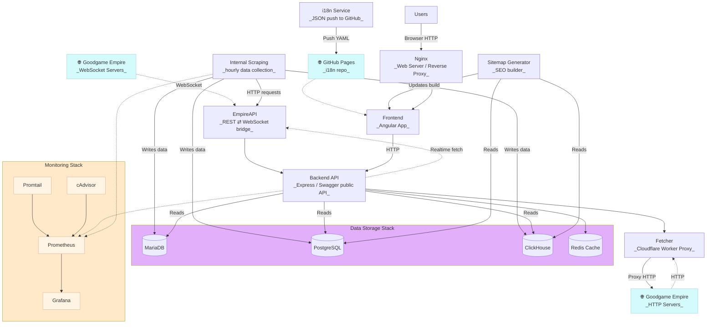

<p align="center">
    
</p>

<p align="center">
    
    
    
    
    
    <a href="https://discord.gg/eb6WSHQqYh" target="_blank">
        
    </a>
    <br>
    
    <a href="https://sonarcloud.io/summary/new_code?id=gge-tracker_gge-tracker"></a>
    <a href="https://sonarcloud.io/summary/new_code?id=gge-tracker_gge-tracker"></a>
</p>

<p align="center">
A comprehensive tracking tool for the game "<a href="https://empire.goodgamestudios.com/">Goodgame Empire</a>" (GGE), designed to help players monitor server activities, player or alliances statistics, and other game-related data.
</p>

## Main components

- **Backend API**: Node.js + Express, provides RESTful endpoints
- **Frontend Application**: Angular web app, interactive interface
- **Scraping Tool**: Node.js service for automatic data collection and updating

## Installation

```bash
# Clone the repository
git clone https://github.com/gge-tracker/gge-tracker.git && cd gge-tracker
# Create a .env file in the root directory with necessary environment variables (see .env.example for reference)
cp .env.example .env && nano .env
# Start the application using Docker Compose (Install Docker and Docker Compose if not already installed)
docker network create backend
docker-compose up --build
```

## Usage

- Web Interface: Access the frontend at `http://localhost:4200`
- API Endpoints: Available at `http://localhost:3000/api/v1`
- Grafana Dashboard: Access at `http://localhost:3001`

## Contributing

Contributions are welcome!

1. Fork the repository
2. Create a new branch (`git checkout -b feature-branch`)
3. Commit your changes (`git commit -m 'Add new feature'`)
4. Push to the branch (`git push origin feature-branch`)
5. Submit a Pull Request

## Project structure

```Shell
├── database # Database configuration and initialization scripts
│   ├── conf # SQL configuration files
│   └── db_migrate.sh # Database migration script
├── docker
│   ├── docker-compose.common.yml # Common Docker Compose configuration
│   └── docker-compose.dev.yml # Development-specific Docker Compose configuration
├── empire-api # Empire API integration module (Custom fork of danadum/empire-api)
├── gge-tracker-backend-api # Backend Express API project
│   ├── src # Project source code
│   ├── Dockerfile.dev # Dockerfile for backend API in development (hot-reload enabled)
│   └── Dockerfile.prod # Dockerfile for backend API in production (static build optimized)
├── gge-tracker-fetcher # Worker service for proxying and fetching data from Goodgame Empire
├── gge-tracker-frontend # Angular frontend application
│   ├── Dockerfile # Optimized Dockerfile for building and serving the Angular app, with nginx as the web server
│   ├── Dockerfile.serve # Development Dockerfile for serving the Angular app (hot-reload enabled)
│   ├── nginx # Nginx configuration for serving the Angular app
│   └── src # Angular project source code
├── gge-tracker-internal-scraping
│   ├── config # Server configuration files
│   ├── scripts # Bash scripts for managing the scraping service (build image, basic fetch, dungeon fetch, etc.)
│   └── src # Scraping service source code
├── gge-tracker-tools # Various utility scripts and tools
├── monitoring # Monitoring stack configuration (Prometheus, Grafana, Loki)
├── sitemap-generator # Sitemap project for SEO optimization and better indexing by search engines
├── .env.example # Example environment variables file
├── .env # Environment variables file (should be created by the user based on .env.example)
└── docker-compose.yaml # Symbolic link to the development Docker Compose file (docker-compose.dev.yml)
```

## System Architecture Diagram

