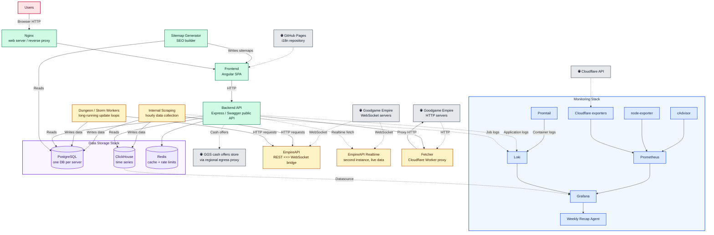

<p align="center">
    
</p>

<p align="center">
    
    
    
    
    
    <a href="https://discord.gg/eb6WSHQqYh" target="_blank">
        
    </a>
    <br>
    
    <a href="https://sonarcloud.io/summary/new_code?id=gge-tracker_gge-tracker"></a>
    <a href="https://sonarcloud.io/summary/new_code?id=gge-tracker_gge-tracker"></a>
</p>

<p align="center">
A comprehensive tracking tool for the game "<a href="https://empire.goodgamestudios.com/">Goodgame Empire</a>" (GGE), designed to help players monitor server activities, player or alliances statistics, and other game-related data.
</p>

## Main components

| Component | Stack | Role |
|---|---|---|
| **Frontend** (`gge-tracker-frontend/`) | Angular SPA (service worker), served statically by Nginx | The public web app: rankings, player and alliance pages, cartography, event trackers |
| **Backend API** (`gge-tracker-backend-api/`) | Node.js + Express, Swagger | The public REST API, Redis-cached, rate-limited |
| **Internal Scraping** (`gge-tracker-internal-scraping/`) | Node.js | Hourly collection of players, alliances and castles; dungeon, storm, outer-realms and wheel-of-affluence jobs |
| **Empire-API** (`empire-api/`) | Node.js, fork of `danadum/empire-api` | REST <=> WebSocket bridge holding persistent connections to the game servers |
| **Fetcher** (`gge-tracker-fetcher/`) | Cloudflare Worker | HTTP proxy to the GGE origins |
| **Sitemap Generator** (`sitemap-generator/`) | Node.js | Builds the SEO sitemaps from PostgreSQL into the frontend's static assets |
| **Monitoring** (`monitoring/`) | Prometheus, Loki, Promtail, Grafana, Tempo, cAdvisor, exporters | Metrics, logs, dashboards and the weekly recap agent |

## Data stores

| Store | Layout | Holds |
|---|---|---|
| **PostgreSQL** | one database per game server (`<BASE_OLAP_DB_NAME>_<servercode>`) | players, alliances, castles, dungeons, storms, movements, renames, ... |
| **ClickHouse** | shared client, one database per server (`empire_ranking*`) | time series: might and loot history, per-event rankings, player metrics |
| **Redis** | shared, `db 0` for dev/prod, `db 1` for mocked backend | API response cache and rate-limiting counters |

## Installation

```bash
# Clone the repository
git clone https://github.com/gge-tracker/gge-tracker.git && cd gge-tracker
# Create a .env file in the root directory with necessary environment variables (see .env.example for reference)
cp .env.example .env && nano .env
# Start the application using Docker Compose (Install Docker and Docker Compose if not already installed)
docker network create backend
docker-compose up --build
```

Node 24 (`.nvmrc`) is expected for running any of the projects outside Docker.

## Usage

`docker-compose.yaml` is a symlink to `docker/docker-compose.dev.override.yml`, the
development stack. It runs three backends side by side against the same Redis and Postgres:

| Service | URL |
|---|---|
| Frontend (Angular CLI, hot-reload) | `http://localhost:4200` |
| Frontend (Nginx, production build) | `http://localhost:4201` |
| Backend API - dev build | `http://localhost:3000/api/v1` |
| Backend API - production build | `http://localhost:3001/api/v1` |
| Backend API - mocked (fixture stack, Redis db 1) | `http://localhost:3002/api/v1` |
| Swagger documentation | `http://localhost:3000/api/v1/docs` |
| PostgreSQL / ClickHouse / Redis | `5432` / `8123` / `6379` |
| Prometheus / Loki | `9090` / `3100` |

## Development

```bash
# Backend API
cd gge-tracker-backend-api && npm run dev        # nodemon, hot-reload
npm run build                                    # tsc + swagger generation
npm run lint

# Frontend
cd gge-tracker-frontend && npm start             # ng serve on 4200
npm run build

# Scraping
cd gge-tracker-internal-scraping && npm run build
./scripts/run-docker-fetch.sh                    # and the other scripts/ entry points

# Fetcher (Cloudflare Worker)
cd gge-tracker-fetcher && npm run dev
```

### Tests

The backend and the scraper each ship a test harness that prints the same report format and
writes a per-run trace under `tests/.trace/`.

```bash
# Backend API - runs against the committed fixture in database/fixtures/
docker compose up -d postgres clickhouse redis-server empire-api empire-api-realtime loki
./database/fixtures/load-fixtures.sh
docker compose up -d backend-express-rest-api-mocked
cd gge-tracker-backend-api && npm run test:api   # the pre-deploy gate
npm run test:api:static                          # openapi + coverage, no server needed

# Scraping - no database, no network
cd gge-tracker-internal-scraping && npm test

# Frontend / Empire-API / Fetcher
cd gge-tracker-frontend && npm test
cd empire-api && npm test
cd gge-tracker-fetcher && npm test
```

## Contributing

Contributions are welcome!

1. Fork the repository
2. Create a new branch (`git checkout -b feature-branch`)
3. Commit your changes (`git commit -m 'Add new feature'`)
4. Push to the branch (`git push origin feature-branch`)
5. Submit a Pull Request

## Project structure

```Shell
├── database
│   ├── conf # ClickHouse and MariaDB configuration files
│   ├── fixtures # Committed test fixture (PostgreSQL + ClickHouse dumps, empire-api mock)
│   ├── internal # Operational dump scripts
│   └── db_migrate.sh # Database migration script
├── docker
│   ├── docker-compose.common.yml # Service definitions shared by every environment
│   ├── docker-compose.dev.yml # Development stack with the monitoring services
│   ├── docker-compose.dev.override.yml # Default dev stack (three backends + fixture mocks)
│   └── docker-compose.prod.yml # Production stack
├── empire-api # REST ⇄ WebSocket bridge (custom fork of danadum/empire-api)
│   ├── src/config # Instance and credential files, bind-mounted read-only at runtime
│   └── tests # Memory, reconnect and live suites
├── gge-tracker-backend-api # Backend Express API project
│   ├── src # Project source code
│   ├── tests # API harness (openapi, coverage, functional, semantic, oracle, snapshot, security, ...)
│   ├── Dockerfile.dev # Dockerfile for backend API in development (hot-reload enabled)
│   └── Dockerfile.prod # Dockerfile for backend API in production (static build optimized)
├── gge-tracker-fetcher # Cloudflare Worker proxying HTTP requests to Goodgame Empire
├── gge-tracker-frontend # Angular frontend application
│   ├── Dockerfile # Optimized Dockerfile for building and serving the Angular app, with nginx as the web server
│   ├── Dockerfile.serve # Development Dockerfile for serving the Angular app (hot-reload enabled)
│   ├── nginx # Nginx configuration for serving the Angular app
│   └── src # Angular project source code
├── gge-tracker-internal-scraping
│   ├── config # Server configuration files
│   ├── scripts # Bash scripts for managing the scraping service (build image, basic fetch, dungeon fetch, etc.)
│   ├── src # Scraping service source code and the dungeon/storm workers
│   └── tests # Regression suite pinning the behaviour of src/main.ts
├── gge-tracker-tools # Various utility scripts and tools
├── monitoring # Monitoring stack configuration (Prometheus, Loki, Promtail, Grafana, Tempo, exporters)
├── sitemap-generator # Sitemap project for SEO optimization and better indexing by search engines
├── .github/workflows # CI (per-project lint/build/test) and SonarCloud analysis
├── .env.example # Example environment variables file
├── .env # Environment variables file (should be created by the user based on .env.example)
└── docker-compose.yaml # Symbolic link to docker/docker-compose.dev.override.yml
```

## System Architecture Diagram

Colours group services by role: <!-- legend -->
**grey** third parties · **amber** collection · **green** serving · **purple** storage · **blue** observability.


```mermaid
graph TD
    %% ==== EXTERNAL SOURCES ====
    ext_ws[🌐 Goodgame Empire<br>WebSocket servers]
    ext_http[🌐 Goodgame Empire<br>HTTP servers]
    ext_store[🌐 GGS cash offers store<br>via regional egress proxy]
    ext_github[🌐 GitHub Pages<br>i18n repository]
    ext_cf[🌐 Cloudflare API]

    %% ==== DATA STORAGE ====
    subgraph datastack[Data Storage Stack]
        postgres[(PostgreSQL<br>one DB per server)]
        clickhouse[(ClickHouse<br>time series)]
        redis[(Redis<br>cache + rate limits)]
    end

    %% ==== COLLECTION ====
    empireapi[EmpireAPI<br>REST <=> WebSocket bridge]
    empireapirt[EmpireAPI Realtime<br>second instance, live data]
    scraping[Internal Scraping<br>hourly data collection]
    workers[Dungeon / Storm Workers<br>long-running update loops]
    fetcher[Fetcher<br>Cloudflare Worker proxy]

    %% ==== SERVING ====
    backend[Backend API<br>Express / Swagger public API]
    sitemap[Sitemap Generator<br>SEO builder]
    frontend[Frontend<br>Angular SPA]
    nginx[Nginx<br>web server / reverse proxy]

    %% ==== MONITORING ====
    subgraph monitoring[Monitoring Stack]
        promtail[Promtail]
        cadvisor[cAdvisor]
        nodeexp[node-exporter]
        cfexp[Cloudflare exporters]
        prometheus[Prometheus]
        loki[Loki]
        grafana[Grafana]
        recap[Weekly Recap Agent]
    end

    %% ==== EXTERNAL LINKS ====
    ext_ws -. WebSocket .-> empireapi
    ext_ws -. WebSocket .-> empireapirt
    ext_http -. HTTP .-> fetcher
    ext_github -.-> frontend
    ext_cf -.-> cfexp

    %% ==== COLLECTION ====
    scraping -->|HTTP requests| empireapi
    workers -->|HTTP requests| empireapi
    scraping -->|Writes data| postgres
    scraping -->|Writes data| clickhouse
    workers -->|Writes data| postgres

    %% ==== SERVING ====
    backend -.->|Realtime fetch| empireapirt
    backend -->|Reads| postgres
    backend -->|Reads| clickhouse
    backend --> redis
    backend --> fetcher
    fetcher -->|Proxy HTTP| ext_http
    backend -.->|Cash offers| ext_store

    sitemap -->|Reads| postgres
    sitemap -->|Writes sitemaps| frontend

    frontend -->|HTTP| backend
    nginx --> frontend

    %% ==== MONITORING CONNECTIONS ====
    promtail -->|Container logs| loki
    backend -.->|Application logs| loki
    scraping -.->|Job logs| loki
    cadvisor --> prometheus
    nodeexp --> prometheus
    cfexp --> prometheus
    prometheus --> grafana
    loki --> grafana
    clickhouse -.->|Datasource| grafana
    grafana --> recap

    %% ==== PUBLIC ENTRYPOINT ====
    user[Users]
    user -->|Browser HTTP| nginx

    %% ==== PALETTE ====
    %% Every class sets fill, stroke AND color: without an explicit text colour
    %% GitHub's dark theme paints light text onto these light fills.
    classDef external fill:#e5e7eb,stroke:#4b5563,stroke-width:1.5px,color:#111827
    classDef store fill:#ede9fe,stroke:#6d28d9,stroke-width:1.5px,color:#2e1065
    classDef collect fill:#fef3c7,stroke:#b45309,stroke-width:1.5px,color:#451a03
    classDef serve fill:#d1fae5,stroke:#047857,stroke-width:1.5px,color:#022c22
    classDef observe fill:#dbeafe,stroke:#1d4ed8,stroke-width:1.5px,color:#172554
    classDef people fill:#ffe4e6,stroke:#be123c,stroke-width:2px,color:#4c0519

    class ext_ws,ext_http,ext_store,ext_github,ext_cf external
    class postgres,clickhouse,redis store
    class empireapi,empireapirt,scraping,workers,fetcher collect
    class backend,sitemap,frontend,nginx serve
    class promtail,cadvisor,nodeexp,cfexp,prometheus,loki,grafana,recap observe
    class user people

    style datastack fill:#faf5ff,stroke:#7c3aed,stroke-width:2px,color:#2e1065
    style monitoring fill:#f0f7ff,stroke:#2563eb,stroke-width:2px,color:#172554
```
